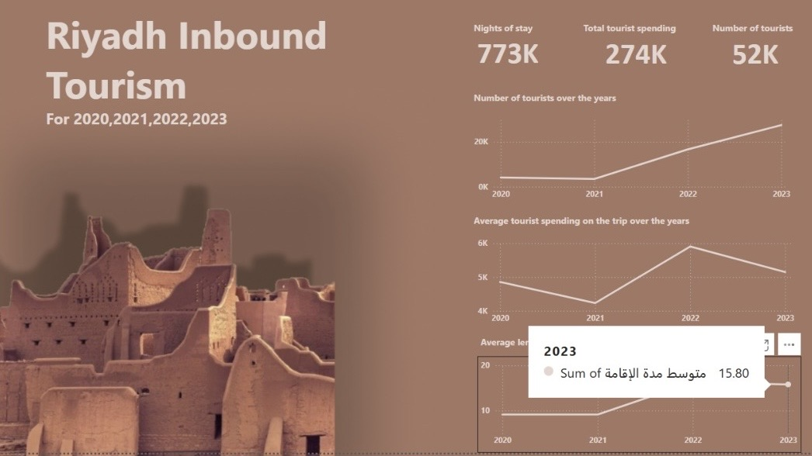

# Riyadh Inbound Tourism Analytics  

## 📖 Project Description  
This project analyzes **inbound tourism in Riyadh** from 2020 to 2023 using official open data provided by the Saudi Open Data Platform. The analysis highlights key metrics such as the number of tourists, overnight stays, and spending trends. The goal is to deliver an **interactive Power BI dashboard** that provides valuable insights for decision-makers, combining **Excel for data preparation**, **Power BI for analytics**, and **Figma for design**.  

---

## 📊 Dataset  
Dataset sourced from the Saudi Open Data Platform: [Riyadh Tourism Data](https://lnkd.in/etfkP64m)  

---

## 📌 Key KPIs  
- **Nights of stay:** 773K  
- **Total tourist spending:** 274K  
- **Number of tourists:** 52K  
- **Average length of stay (2023):** 15.8 nights  

---

## ⚙️ Process  
1. **Excel** – cleaning, organizing & preparing the raw data.  
2. **Power BI** – building an interactive dashboard to visualize trends and KPIs.  
3. **Figma** – designing a branded background inspired by Diriyah to enhance presentation aesthetics.  

---

## 🔎 Insights  
- Tourist numbers rose significantly between 2021–2023.  
- Tourist spending peaked in 2022, followed by a slight dip in 2023.  
- The average duration of stay has grown gradually over time.  

---

## ✅ Conclusion  
Leveraging open data enables data-driven decision-making. This interactive dashboard provides valuable insights for tourism stakeholders in Riyadh, enabling improved strategic planning and visualization of complex data in a user-friendly format.  

---

## 🖼️ Dashboard Preview  
  

